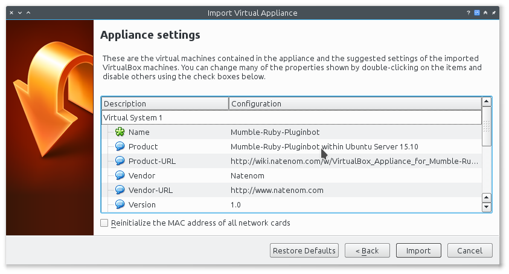
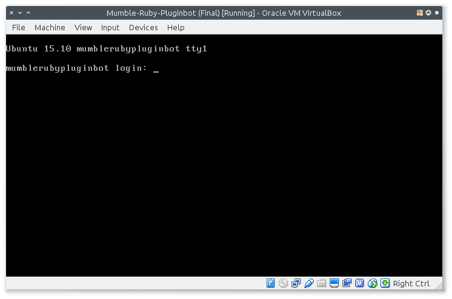
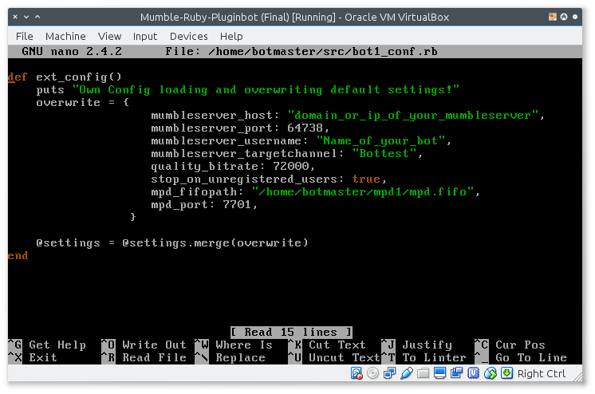
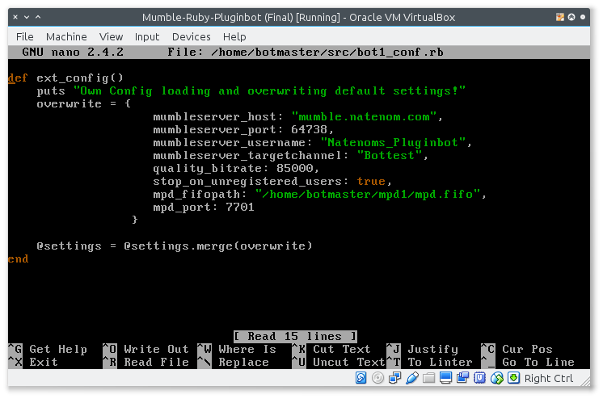
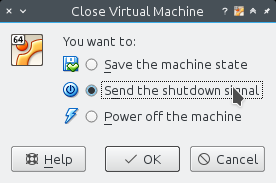

.. _appliance-label:

VirtualBox Appliance for Mumble-Ruby-Pluginbot
==============================================

This page shows you how to download the VirtualBox Appliance for the :ref:`start-label` and import it into your VirtualBox.

You only need to configure the ip of your Mumble-Server, the username. Then you can register your bot on your server; thats it :)

The result is a fully functional instance of the :ref:`start-label`.

Download the appliance
----------------------

.. _note::

  `Download the appliance from here`_ and save it somewhere on your computer.

  .. _Download the appliance from here: https://www.robingroppe.de/media/mumble-ruby-pluginbot/Mumble-Ruby-Pluginbot-2.3%20(Bot%20version%200.9.1.2%20-%20Sparkling%20Soda%20(Out%20of%20Gas)).ova

  The file size is around 700/800 MiB.

  This version was created on 18th October 2016.

  The sha256 checksum of the current version is: '''18fed86a5a53f109f54e88f7a0cb1e15add60db0487b4e795941d21f7795c5f2'''

.. _note::

  Please consider a [https://www.paypal.com/cgi-bin/webscr?cmd=_s-xclick&hosted_button_id=SZCFW87WLSSKJ donation via PayPal] if you like this appliance to support the work :)

Import appliance into VirtualBox
--------------------------------

Of course you must have `VirtualBox`__ installed.

__ http://virtualbox.org/

Start it, open the menu and select "Import Appliance...":

.. image:: images/appliance/Virtualbox_appliance_mumblerubypluginbot_import.png

Navigate to the downloaded file and select it in the dialog.

Then you get the following to see:

Click on "Import" and wait.

When the import finished you should have a new virtual machine called "Mumble-Ruby-Pluginbot".

Start the virtual machine
-------------------------

Now start the virtual machine and login.

Login as botmaster, the password is also botmaster.

Change bot settings so that the bot can connect to your Mumble server
---------------------------------------------------------------------

.. _note::

  - Please note that on most Mumble servers you can't use space characters in usernames; use an underscore ("_") instead.
  - If you set the value of mumbleserver_targetchannel to "" the bot enters the default channel on the first connect and the previous channel on reconnect once he is registered.

Edit the bot configuration::

  nano /home/botmaster/src/bot1_conf.rb

This is my example setup for my own bot:

If you made your changes press {{KKey|Ctrl}} + {{KKey|o}}, followed by {{KKey|Enter}} to save the file and then {{KKey|Ctrl}} + {{KKey|x}} to leave the editor.

Now restart the virtual machine::

  sudo reboot

Thats it :)

Have fun with your own :ref:`start-label` and `contact me`_ if you have feedback.

.. _contact me: https://www.natenom.com/

Now register your new bot on your Mumble server and write .help to him.

Administration of the bot
-------------------------

Set up keyboard
^^^^^^^^^^^^^^^

The keyboard is set to german layout (de:nodeadkeys); to change it run::

    sudo dpkg-reconfigure keyboard-configuration

Then reboot the virtual machine.

Update the bot
^^^^^^^^^^^^^^

Log in as user botmaster with password botmaster and do the following::

  /home/botmaster/src/mumble-ruby-pluginbot/scripts/updater.sh
  sudo reboot

Stop the bot
^^^^^^^^^^^^

To stop the bot, press the red X of the virtual machine window and choose "Send the shutdown signal" from the dialog.

Information about the appliance
-------------------------------

This is just for your information, no need to do anything here.

VirtualBox configuration
^^^^^^^^^^^^^^^^^^^^^^^^
- System partition: 5 GB (dynamic size)
- Home partition: 100 GB (dynamic size, it grows while you download songs)
- No swap partition is available.
- RAM: 512 MiB
- CPU count: 1
- Network type: NAT
- Both partitions are configured as "Solid State Disks" and discard is enabled in the xml configuration file so that the partition size should shrink when you delete files. Thanks @neti for this hint :) This is done once a week in Ubuntu through the `fstrim`_ command.

.. _fstrim: https://wiki.archlinux.org/index.php/Solid_State_Drives#Apply_periodic_TRIM_via_fstrim

System settings
^^^^^^^^^^^^^^^

- System: Ubuntu Server 16.04 LTS 64bit
- Hostname: mumblerubypluginbot
- Keyboard layout: de:nodeadkeys
- SSH: Not installed at all, for security reasons :)

User credentials
^^^^^^^^^^^^^^^^

- Username: botmaster
- Password: botmaster

The user is allowed to use sudo.

Known issues
------------

- If the virtual machine doesn't start on Windows 8+, try to disable Hyper V, see `here`__.

__ http://www.eightforums.com/tutorials/42041-hyper-v-enable-disable-windows-8-a.html

- If you are using Proxmox, you need to convert the Virtual appliance .ova file, see `here`__.

__ http://www.jamescoyle.net/how-to/1218-upload-ova-to-proxmox-kvm
